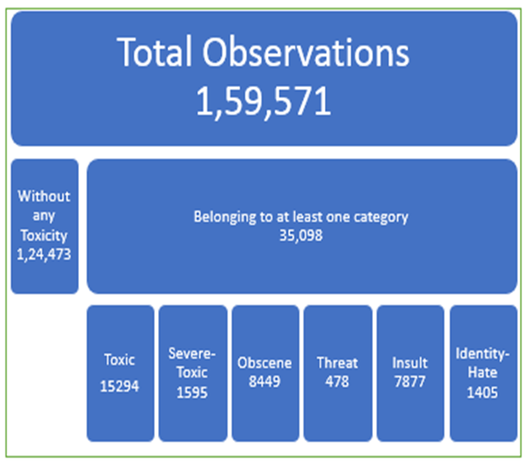
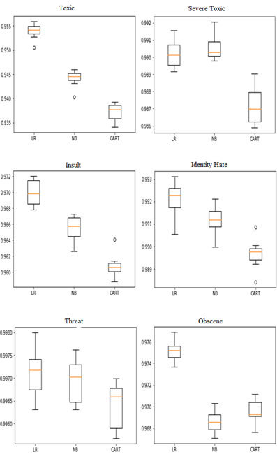
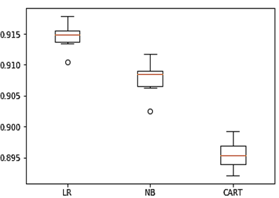

## Toxic Comment Classification (A multi-label classification problem)

This folder applies almost everything that I learned from this course.

The main purpose of this project is to classify new comments against six types of toxicities. These toxicities are: -

| toxic     | severe_toxic | obscene   | threat    | insult    | identity_hate |
| --------- | ------------ | --------- | --------- | --------- | ------------- |
| yes or no | yes or no    | yes or no | yes or no | yes or no | yes or no     |

The solution caters to the problem in two different ways: -

1. **Binary Classification**: Train six Logistic regression (and other) models for each toxicity facet and classify each un-seen sample comment on each model. We achieved a very good accuracy for each instance.
2.  **Map Multi-label classification problem to multi-class problem**: Converting the problem into multi-class results in $2^6$ class labels. But a little trick can reduce the class labels count to 32.  
   - Observation 01: If a comment is not `toxic`, it can't be `sever_toxic`. Similarly, it should not have any other facet of toxicity. Therefore, all those class labels that start with a `0`, in the beginning, are contrary to reality. 
     - There are 32 such class labels. So, we replace all these labels with a label `000000`

## Data Distribution

## Results

### Binary Classification

Cross-Validation Accuracies for each toxicity facet over the three machine-learning models

| Class  Labels | Logistic  Regression | Naïve  Bayes | CART   |
| ------------- | -------------------- | ------------ | ------ |
| Toxic         | 95.39%               | 94.43%       | 93.71% |
| Severe Toxic  | 99.02%               | 99.05%       | 98.72% |
| Obscene       | 97.52%               | 96.87%       | 96.93% |
| Threat        | 99.71%               | 99.69%       | 99.64% |
| Insul**t**    | 97.00%               | 96.54%       | 96.05% |
| Identity Hate | 99.21%               | 99.12%       | 98.97% |

### Multi-labeled Classification

Multi-labeled Cross-Validation Accuracies

| Classifier           | Cross-Validation  Accuracy |
| -------------------- | -------------------------- |
| Logistic  Regression | 91.48%                     |
| Naïve  Bayes         | 90.78%                     |
| CART                 | 89.54%                     |

## Conclusion

The study, after proper evaluation, concludes that works well for this kind of problem. The dataset is biased (i.e., the number of instances for certain toxicities is minute) and our solution does not account for that. Readers are encouraged to explore RNNs and community biases for further extension.

## Data Availability 

The full paper is available at: https://ieeexplore.ieee.org/abstract/document/9445252

The dataset is available at: https://drive.google.com/file/d/1NiIHvmvgSfjA5GJ0AaY5-lBl-ETOquED/view?usp=sharing

